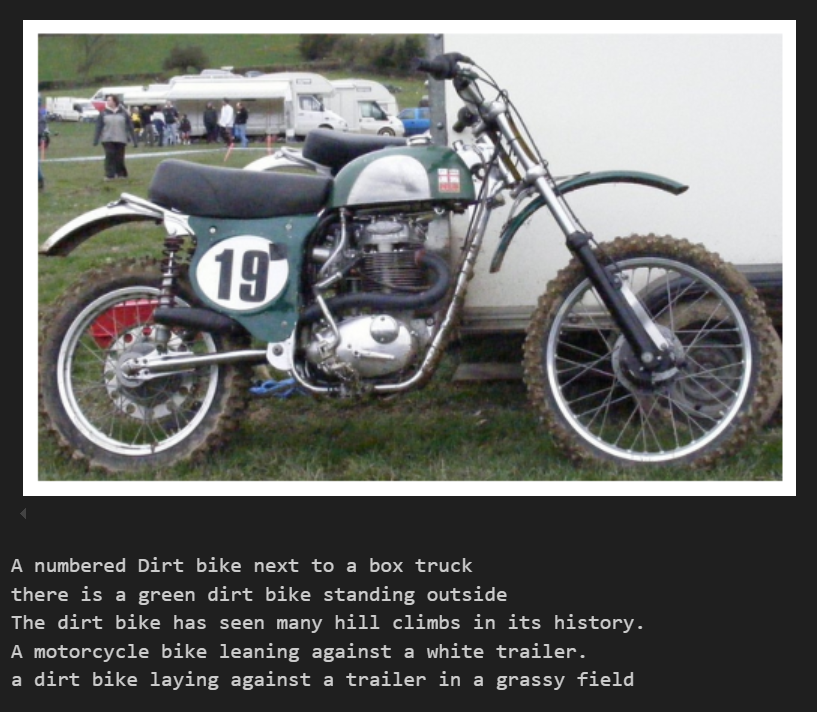

# Image-Captioning

This repository contains my project for the **Introduction to Computer Vision** course, where I built a deep learning model to automatically generate natural language captions for images.

## 📌 Project Overview

Image captioning is a challenging task that bridges computer vision and natural language processing. It involves generating descriptive textual captions for images. In this project, I implemented an **Encoder-Decoder architecture** that uses a pre-trained CNN to extract image features and a custom RNN decoder to generate captions.

## 📂 Project Structure

- **0. Dataset.ipynb**: Visualizing and understanding the dataset
- **1. Preliminaries.ipynb**: Tokenized captions, built a vocabulary, and created custom data loaders to handle image-caption pairs.
- **model.py**: Created a custom encoder-decoder network architecture.
  - **EncoderCNN**: Utilized a pre-trained ResNet-18 to extract image feature embeddings.
  - **DecoderRNN**: Constructed an LSTM-based decoder that generates captions conditioned on the image features.
- **2. Training.ipynb**: Trained the encoder=decoder model using the MS-COCO dataset
- **3. Inference.ipynb**: Used to generate captions for unseen images

## 📝 Dataset

The model was trained on the **MS-COCO dataset**, which contains over 82,000 images, each annotated with five captions. It provides a rich and diverse set of images and descriptions, making it ideal for training captioning models.

## 🛠️ Tools & Libraries

- Python
- PyTorch
- Torchvision
- NLTK
- NumPy
- Matplotlib

## 📊 Results

The trained model successfully generated meaningful and descriptive captions for new images. Caption quality was evaluated using qualitative assessment.

## 📖 What I Learned

- Combined pre-trained CNNs and RNNs for sequence generation tasks
- Implemented a custom vocabulary and data loader for multi-caption datasets
- Applied transfer learning, and hyperparameter tuning
- Gained experience working with large-scale image-caption datasets (MS-COCO)

## 📸 Sample Output

